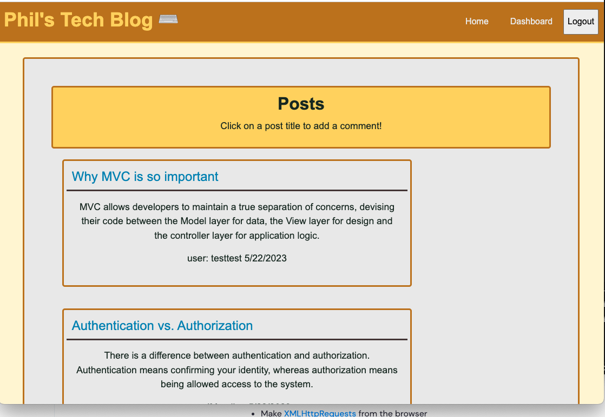
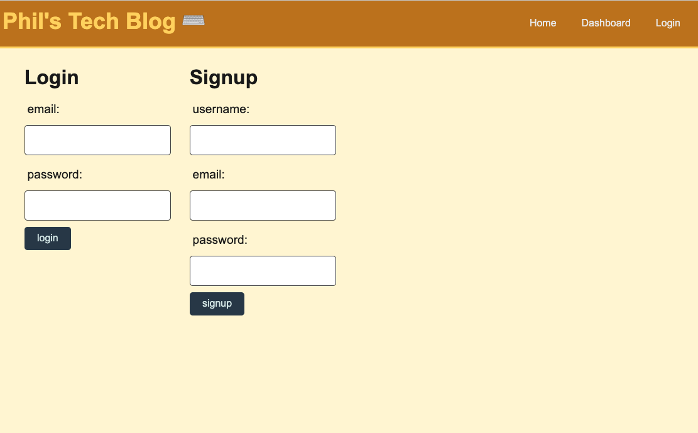

# Phils-Tech-Blog
  -------------------
  ## Badges
  -------------------
    
  ## Table of Contents  
  ----------------------
  - [Description](#description) 
  - [Usage](#usage)  
  - [Installation](#installation)   
  - [Contributing](#contributing)  
  - [Questions](#questions)
  - [License](#license)
    

  ## Description  
  -------------------
  Uses Nodejs, expressjs and MVC design to create a dynamic blog where users can add posts, comment on posts and delete their own posts. Uses handlebars template engine to populate the views for the user, and express server runs the backend with a database the uses sequelize npm for database interactions. 

  
  
  

  ## Usage  
  ------------
  Visit the website at [https://phil-tech-blog.herokuapp.com/ ](https://phil-tech-blog.herokuapp.com/) and create a user account.
 
  ## Installation  
  -------------------
  For the server, clone the repo and run `npm install` to install dependencies. You can seed the database by running `npm seed`. Run `npm start` to start the server and go to localhost:3001/ to load the homepage.

  ## Credits 
  ------------------
  I used knowledge learned from the Rice University Coding Bootcamp as well as MDN docs and StackOverflow

  ## Contact Information
  -------------------------
  ### Github: [Phillip Pfister](https://github.com/Phil-Pfister)
  ### Email: salshouse@gmail.com

  
  ## License 
-------------- 
This application uses the The Unlicense license
  

